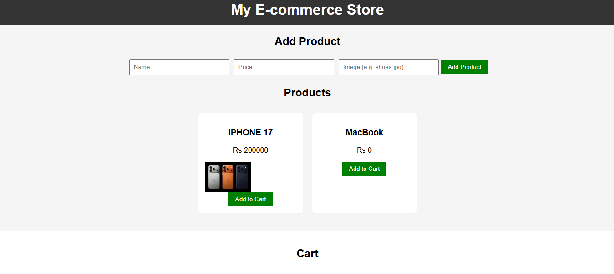
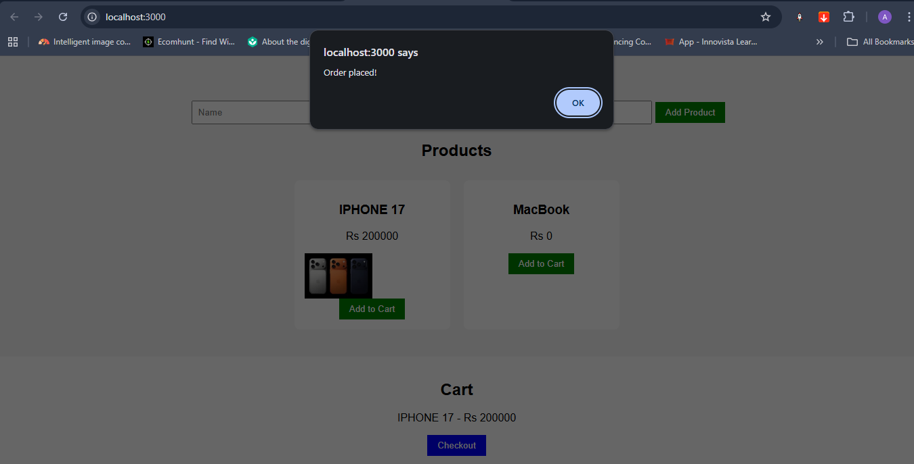
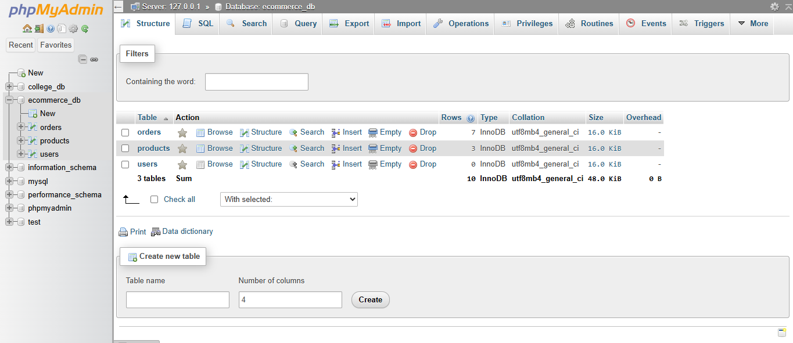
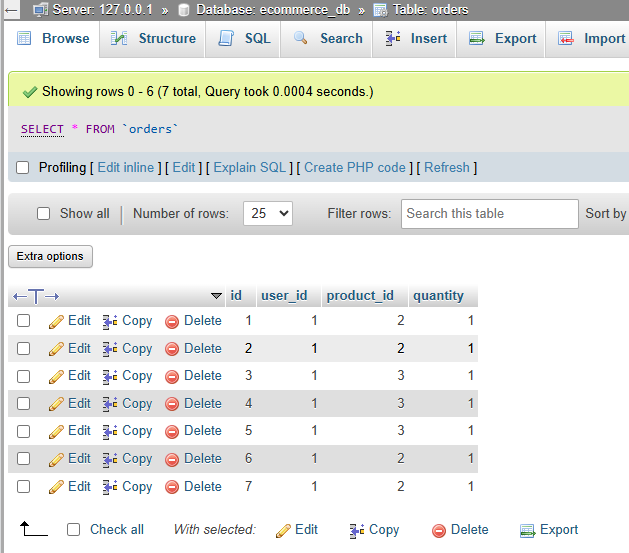
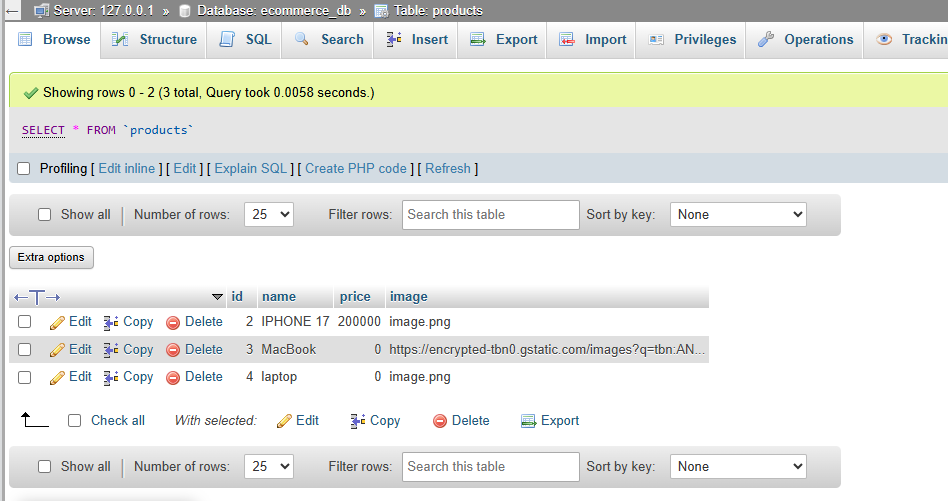

### 🛒 Web Commerce Project


## 📖 About The Project

The **Web Commerce Project** is a full-stack e-commerce web application built using **HTML, CSS, JavaScript (Frontend)** and **PHP & MySQL (Backend)** using XAMPP.

It allows users to browse products, manage shopping cart functionality, and perform basic e-commerce operations.

---

## 🚀 Features

- 🛍️ Product listing page  
- 🛒 Add to cart system  
- 🔐 Basic backend integration (PHP)  
- 🗄️ MySQL database connectivity  
- 🎨 Responsive and simple UI design  
- ⚡ Fast local development using XAMPP  

---

## 🧰 Tech Stack

**Frontend:**
- HTML5
- CSS3
- JavaScript

**Backend:**
- PHP

**Database:**
- MySQL (phpMyAdmin via XAMPP)

**Tools:**
- XAMPP Server
- Git & GitHub
- VS Code

---

## 📁 Project Structure

backend/
│
├── frontend/ # HTML, CSS, JS files
├── backend/ # PHP logic files
├── database/ # SQL database file (if any)
└── README.md


---

## ⚙️ Installation & Setup

### 1. Clone the repository
```bash
git clone https://github.com/Ashnaali3255/Web-CommerceProject.git

2. Move project to XAMPP directory

Place the folder inside:

C:\xampp\htdocs\

3. Start XAMPP
Start Apache
Start MySQL
4. Run project in browser
http://localhost/backend/frontend

🗄️ Database Setup
Open phpMyAdmin
Create a new database (e.g. web_commerce)
Import .sql file (if included in project)
Update database connection in PHP files

📸 Screenshots








LIVE VIDEO DEMO
https://www.loom.com/share/7fdd0497110947f5af289c6e87f9a893

👩‍💻 Developer
Name: Ashna Ali (Group 2)
Project: Web Commerce System
Role: Full Stack Development (Frontend + Backend)

🌟 Future Improvements

User login & authentication system
Payment gateway integration
Admin dashboard
Product search & filtering
Better UI/UX design
